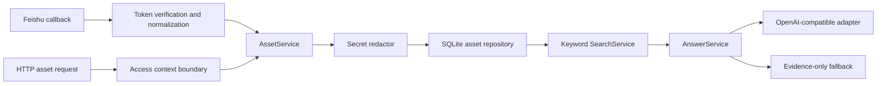

# MVP Foundation Architecture

## Purpose

This milestone proves one security-first path through the system:

```text
manual/Feishu text
→ verification and validation
→ secret redaction
→ tenant-scoped persistence
→ evidence retrieval
→ optional grounded generation
→ citation-bearing response or safe degradation
```

It is deliberately not the complete architecture described in the PRD.

## Runtime modules



### `packages/core`

- `SecretRedactor` finds supported secret patterns and replaces them before repository calls.
- `AssetService` validates ingestion, hashes safe content, and creates stable ingestion commands.
- `AssetRepository` requires `AccessContext` on every public read method.
- `SqliteAssetRepository` implements idempotency, safe-content deduplication, multiple source locations, tenant filtering and owner filtering.
- `SearchService` performs deterministic keyword ranking and produces stable evidence IDs.
- `AnswerService` accepts generated prose only if at least one valid retrieved citation is present.
- `OpenAiCompatibleClient` appends `/chat/completions`, times out requests, and sanitizes provider errors.

### `apps/api`

- Access-context hook protects product routes.
- Asset, search and answer routes expose the core services.
- Feishu event service verifies callback tokens with constant-time digest comparison, handles URL verification, normalizes supported text events and relies on asset idempotency for duplicate delivery.
- The global error handler returns stable safe shapes and does not echo request bodies or provider bodies.
- `server.ts` is the only composition root that loads environment variables and starts the network listener.

## Security invariants

1. Secret redaction happens before `AssetRepository.ingest`.
2. The stored content hash is calculated from redacted content, not raw secret values.
3. Repository reads cannot be called without tenant and user context.
4. Owner-visible data is never returned to another user, including a user in the same tenant.
5. LLM prompts contain only already-authorized, already-redacted evidence.
6. Provider errors do not include response bodies or API keys.
7. An LLM response without a valid `[S<n>]` citation is discarded.
8. Feishu callbacks with an invalid verification token are rejected before content parsing or persistence.
9. Duplicate external events are acknowledged without creating duplicate assets.

## Persistence model

SQLite is used only for the pilot slice. Tables are:

- `assets`: safe content and access metadata.
- `asset_sources`: one or more source locations per asset.
- `asset_ingestions`: tenant-scoped idempotency key to asset mapping.

The repository boundary permits a later PostgreSQL implementation. The current hash deduplication key contains tenant, owner, visibility and redacted-content hash. Two documents differing only in a detected secret intentionally collapse to the same safe asset in this milestone because secret values are discarded.

## Search truthfulness

The current search mode is `keyword`, not vector or hybrid search. Chinese queries are expanded into deterministic bigrams for basic recall. This is sufficient to test API, permission and citation behavior but not sufficient for production relevance targets in the PRD.

Vector retrieval, reranking, entity expansion and source ACL synchronization remain future milestones. The `/health` endpoint exposes `searchMode=keyword` so clients cannot silently mislabel the implementation.

## LLM gateway

The adapter targets an OpenAI-compatible endpoint:

```text
<LLM_BASE_URL>/chat/completions
```

With the supplied base URL shape, the resulting route is:

```text
https://llm-gw.bupt.edu.cn/v1/chat/completions
```

No live request was made with the key shared in chat because that key should be treated as compromised. Once rotated, the model ID must be configured explicitly. If the gateway is disabled, unavailable, times out, returns an invalid payload, or produces prose without citations, users still receive evidence and source metadata.

## Feishu boundary

Implemented:

- URL verification challenge.
- Verification Token check.
- `im.message.receive_v1` text normalization.
- Tenant/user derivation from verified event metadata.
- Owner-only default visibility.
- Event delivery idempotency.

Not implemented:

- Encrypt Key payload decryption.
- Feishu OAuth and tenant authorization.
- Cloud document/wiki/file synchronization.
- Source ACL synchronization and revocation propagation.
- Outbound bot messages or cards.
- Media/file parsing.

These missing controls block public production deployment but do not block local behavior testing.

## Next implementation milestones

1. Replace trusted development headers with Feishu OAuth sessions and server-derived access context.
2. Add Feishu tenant access token management, outbound private replies and interactive cards.
3. Add cloud document/wiki connector with cursor-based incremental sync and source ACL snapshots.
4. Add PostgreSQL, object storage, background jobs and permission-revocation cache invalidation.
5. Add hybrid retrieval evaluation before introducing vector search to production.
6. Build the desktop search surface and global shortcut against the stable API.
